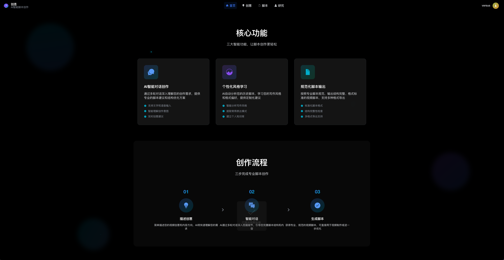
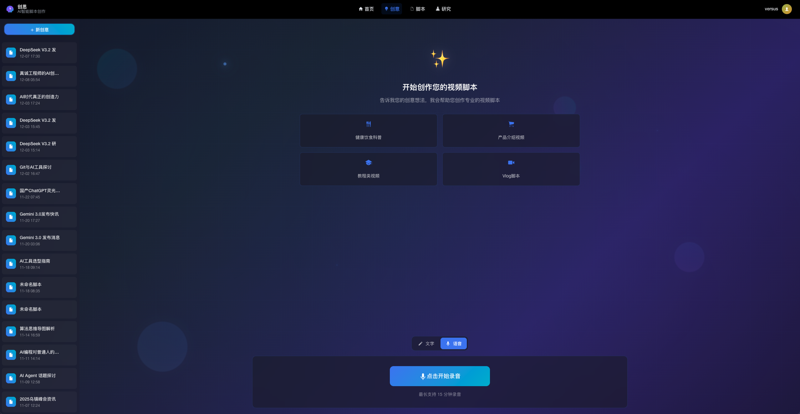
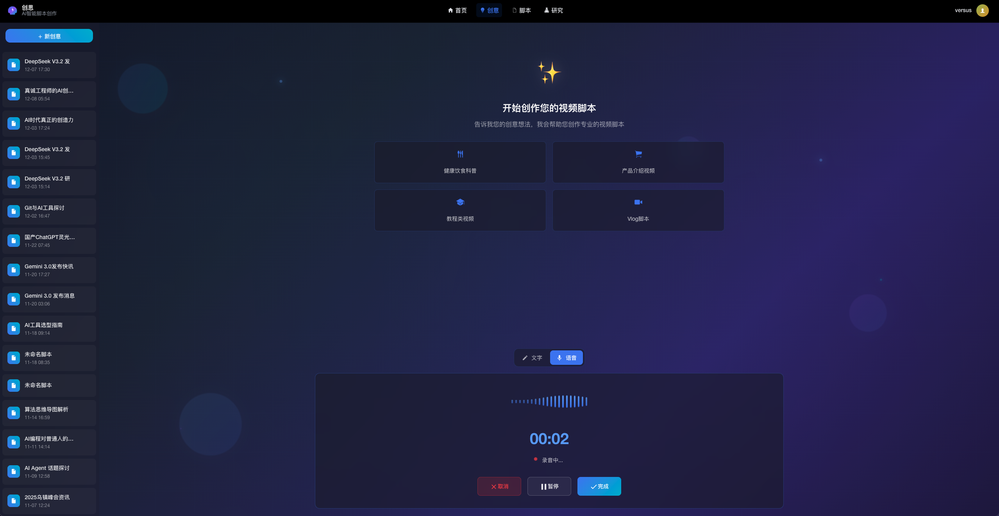

# 创思（Creator）开源版

一站式“语音→灵感→脚本”工作台：用 Whisper（默认 faster-whisper 提速）做本地/云转写，结合对话式 AI 把口述灵感快速沉淀为成品脚本。

## 功能预览

## 主要特性
- 语音转写提速：faster-whisper 本地优先，支持云端切换，语音想法即时落地
- 对话式脑暴：围绕主题多轮交流，可带用户画像/标签/上下文
- 一键生成脚本：从对话上下文输出口播/短视频脚本，结构化可直接落地
- 多端入口：Web / BO / 微信端复用统一后端 API
- 稳定底座：Huey 任务、PostgreSQL + Redis、JWT 认证

## 技术栈
- 后端：FastAPI + SQLAlchemy 2.0 + Pydantic 2.x，Huey 任务队列，Redis 缓存，PostgreSQL 存储
- 语音：faster-whisper 优先，FFmpeg 处理，支持本地/云切换
- 前端：Vue 2 + iView / Mint UI（web / bo / wechat 子项目）

## 快速开始（后端 vige-api）
1. `cd creator-api`
2. `pipenv install && pipenv shell`
3. 新建并填写 `creator/local_config.env`（本地私密配置，已被忽略）
4. 可选：创建 `creator/api/conversations/local_prompts.py` 放置你的真实 prompt（文件已被忽略）
5. 运行：`python app.py`

## 前端启动（vige-web / vige-bo / vige-wechat）
进入对应子目录执行 `yarn install && yarn serve`，按需配置环境变量。

## 相关项目
- 基于本框架的衍生项目示例：https://github.com/Versus2017/vige/tree/public-master

## 反馈与贡献
欢迎 Issue / PR 指正与改进。如果你在性能、体验、架构上有建议，随时留言或提交代码；感谢一起把“语音→脚本”链路打磨得更顺畅。
