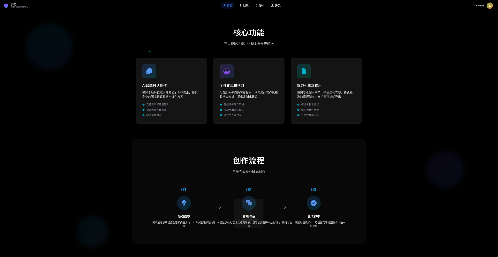
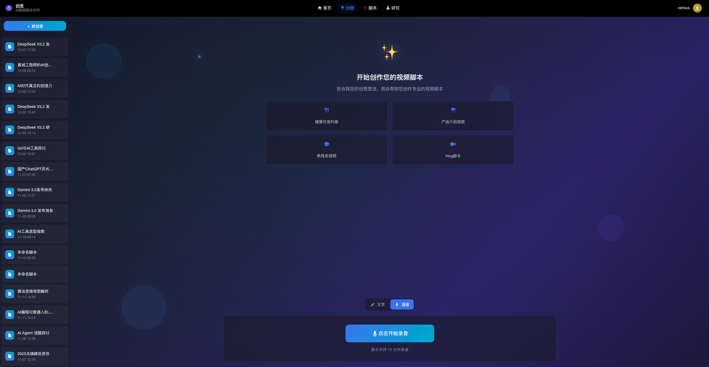
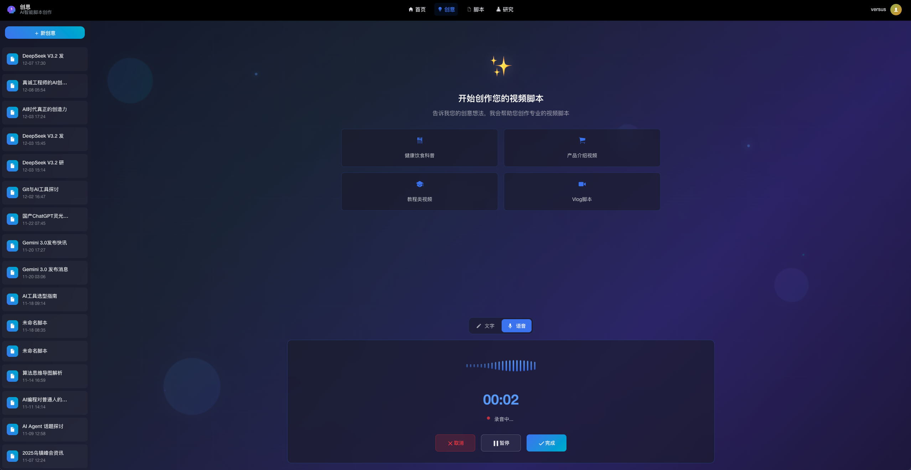
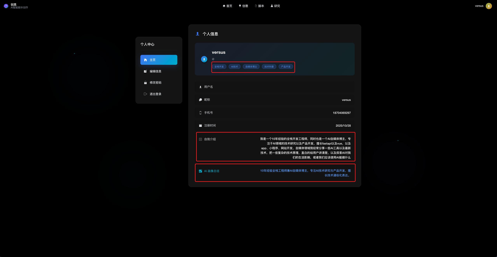

# 创思（Creator）开源版

> **最新版本 · 2026.06** — 从「AI 对话写脚本」升级为**完整内容生产工作台**：脚本可分享交付、可 AI 生图，并支持 **Codex / MCP** 供外部 Agent 调用。

一站式「语音→灵感→脚本」工作台：Whisper（默认 faster-whisper）转写 + 对话式 AI，把口述灵感快速沉淀为可落地的视频脚本。

---

## ✨ 本版更新亮点

<details open>
<summary><strong>相对上一版 GitHub，新增了什么？（点击折叠）</strong></summary>

<br />

| 模块 | 上一版 | 本版 |
|------|--------|------|
| 脚本交付 | 在线查看、编辑 | **+ ZIP 分享**（`index.html` + 封面/素材图，解压即看） |
| 视觉资产 | 无 | **+ AI 封面 & 段落素材图**（竖版/横版 4K，按脚本内容规划生成） |
| 外部集成 | 无 | **+ Codex / MCP**（`creator-mcp` + `/codex/creator/*`） |
| 创作上下文 | 单会话对话 | **+ 引用历史脚本**、**用户画像注入**、**可配置对话模型** |
| 视频衔接 | 无 | **+ HyperFrames 素材清单**（脚本 + 图片一键交接） |
| 语音输入 | 基础转写 | **+ 流式分块转写**、设备选择、失败重试与幻听过滤 |

**一句话**：Creator 不再只是写脚本，而是能**导出、配图、对接 Agent、衔接视频生产**的全链路起点。

</details>

### 新增功能一览

| 图标 | 功能 | 说明 |
|:----:|------|------|
| 📦 | **脚本分享** | 详情页一键导出 ZIP；含 Markdown 正文、封面与素材图，支持中文文件名 |
| 🎨 | **AI 生图** | 按脚本生成竖版/横版封面 + 段落 B-roll 素材；`gpt-image-2`，批次进度可追踪 |
| 🤖 | **Codex / MCP** | `creator_start_script_conversation`、`creator_get_hyperframes_manifest` 等工具 |
| 🔗 | **HyperFrames** | 获取脚本 + 图片 + 使用建议的 manifest，对接后续视频制作 |
| 💬 | **创作增强** | 对话引用历史脚本快照；用户简介/标签注入 system prompt |
| 🎙️ | **语音优化** | 长录音分块上传、SSE 进度、Whisper 冷启动重试、分块合并兜底 |

> **配置文档**：[模型与密钥配置](docs/configuration/模型与密钥配置.md) · [MCP 配置说明](creator-mcp/README.md)  
> 快速开始：复制 `creator-api/creator/local_config.env.example` → `local_config.env` 后填入 Key。

---

## 功能预览






## 项目结构

| 目录 | 说明 |
|------|------|
| `creator-api` | 后端 API（FastAPI + PostgreSQL） |
| `creator-web` | Web 前端 |
| `creator-bo` | 后台管理 |
| `creator-wechat` | 微信 H5 |
| `creator-mcp` | Codex MCP 桥接服务 |

## 主要特性

- 语音转写提速：faster-whisper 本地优先，支持云端切换
- 对话式脑暴：多轮交流，可带用户画像、标签、历史脚本引用
- 一键生成脚本：输出口播/短视频脚本，结构化可直接落地
- 脚本分享：导出 ZIP（`index.html` + 封面/素材图），离线查看
- AI 生图：按脚本生成封面与段落素材图
- Codex / MCP：`creator-mcp` + `/codex/creator/*`，供外部 Agent 调用
- 多端入口：Web / BO / 微信端复用统一后端 API

## 技术栈

- 后端：FastAPI + SQLAlchemy 2.0 + Pydantic 2.x，Huey 任务队列，Redis，PostgreSQL
- 语音：faster-whisper 优先，FFmpeg 处理
- 前端：Vue 2 + iView / Mint UI

## 快速开始

### 后端（creator-api）

```bash
cd creator-api
cp creator/local_config.env.example creator/local_config.env   # 填入 API Key
pipenv install && pipenv shell
createdb creator && make upgrade-db
make run          # API 服务
make worker       # 语音转写等后台任务（另开终端）
```

详细步骤见 [creator-api/README.md](creator-api/README.md)。

可选：创建 `creator/api/conversations/local_prompts.py` 覆盖默认 prompt（该文件已被 gitignore）。

### 前端

```bash
cd creator-web && yarn install && yarn serve
```

- 后台管理：`creator-bo`
- 微信 H5：`creator-wechat`

### MCP（可选）

见 [MCP 配置说明（中文）](creator-mcp/README.md)。模型与 Key 见 [模型与密钥配置](docs/configuration/模型与密钥配置.md)。

## 相关项目

- 基于本框架的衍生项目示例：https://github.com/Versus2017/vige/tree/public-master

## 关注作者

欢迎关注我的社交媒体账号，分享更多关于独立开发、AI 应用与数字游民的实战干货：

- **抖音 / 小红书 / 视频号**：数字游民v哥

<p align="left">
  
  
  
</p>

## 反馈与贡献

欢迎 Issue / PR。配置说明：`creator-api/creator/local_config.env` 存放密钥与本地覆盖项（已被 gitignore，不会提交）。
